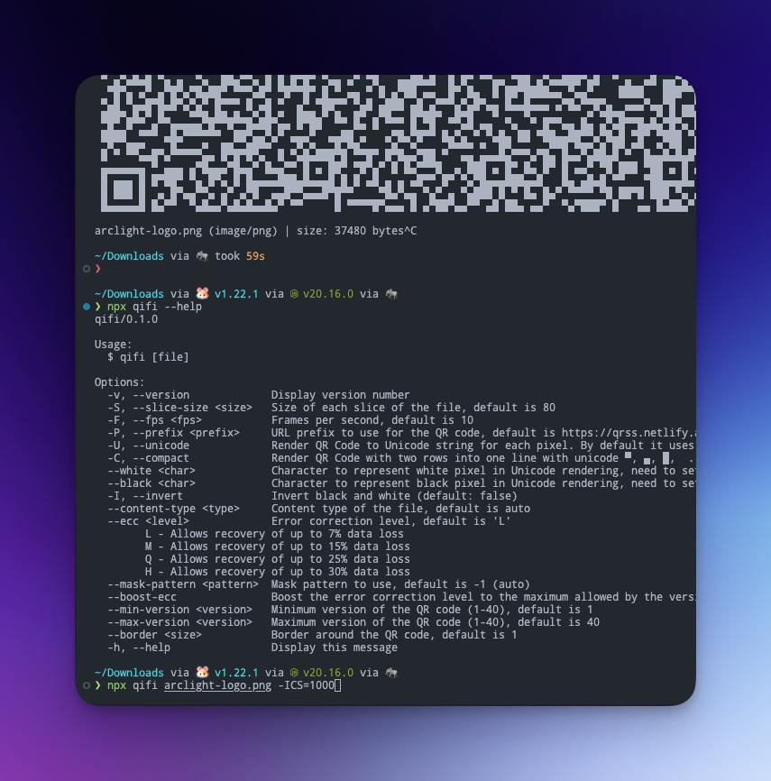

# QiFi CLI

<!-- Some beautiful tags -->
<p align="left">
  <a href="https://www.npmjs.com/package/qifi/">
    
  </a>
  <a href="#usage">
    
  </a>
  <a href="https://github.com//LittlsponsorseSound">
    
  </a>
</p>

Stream Generated QR Codes for file transmission in your terminal

## Sponsors

<p align="center">
  <a href="https://github.com/sponsors/LittleSound">
    
  </a>
</p>

<p align="center">
  This project is made possible by all the sponsors supporting my work <br>
  You can join them at my sponsors profile:
</p>
<p align="center"><a href="https://github.com/sponsors/LittleSound"></a></p>

## Usage

Get document

```bash
npx qifi --help
```

Stream file

```bash
npx qifi ./file.txt
```

Stream file with custom chunk size

```bash
npx qifi -ICS=1000 ./file.txt
```

You can use any scanner to scan the dynamic QR code. This will redirect to [a scanner website in the browser](https://qrss.netlify.app) to actually obtain the file data from the QR code.

## Demo


